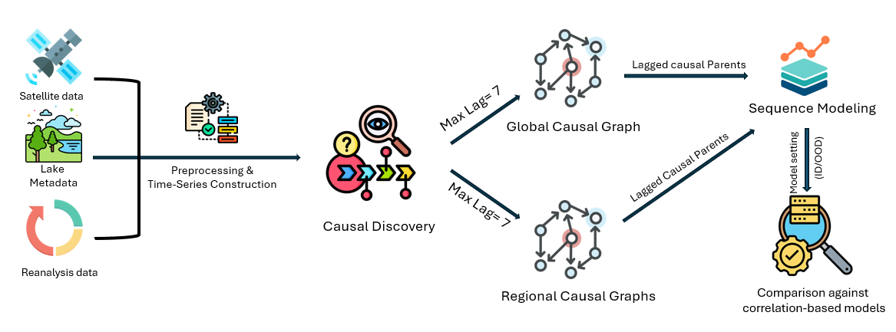

# RIC-TSC: Causal Time Series Modeling of Supraglacial Lake Evolution in Greenland under Distribution Shift

This repository provides the implementation for **"Causal Time Series Modeling of Supraglacial Lake Evolution in Greenland under Distribution Shift"**, a submitted paper to ACM SIGSPATIAL 2025. We introduce a regionally-informed causal framework that discovers lagged environmental drivers of supraglacial lake (SGL) evolution across Greenland and uses these causal signals for robust sequence modeling under spatial distribution shift.

---
## Introduction

Supraglacial lakes (SGLs) exhibit complex spatiotemporal behaviors such as `rapid drainage`, `slow drainage`, `refreezing`, and `burial`. Accurate classification of lake evolution is critical to understanding meltwater runoff and ice sheet stability.

This repository presents a **causally-informed modeling framework** that identifies **invariant environmental drivers across Greenland** using Joint PCMCI+ (J-PCMCI+), and also captures **region-specific causal mechanisms** in individual basins. These **causal predictors** are then used in downstream **sequence modeling** to improve robustness and generalization under distribution shifts. We assess performance in global, in-distribution (ID), and out-of-distribution (OOD) settings.

---

## Methodology

We construct daily multivariate time series from satellite and reanalysis sources:
- **Sentinel-1 SAR** (HV backscatter anomaly)
- **Sentinel-2 and Landsat-8 optical imagery** (NDWI-based water fraction, solar zenith)
- **CARRA-West reanalysis** (temperature, humidity, pressure, SST, etc.)

J-PCMCI+ is applied globally and per region to identify lagged causal parents of HV_anom (horizontally transmitted, vertically received backscatter anomaly), a proxy for lake water presence. These causal features are then used for lake evolution classification.

<p align="center">
  
</p>

---

## Installation

Clone the repository and set up the environment:

```bash
git clone https://github.com/ehfahad/RIC-TSC.git
cd RIC-TSC
conda env create -f environment.yaml
conda activate base
```
---

## Directory Structure

```
RIC-TSC/
├── causality/                         # J-PCMCI+ causal discovery notebooks (ALL + per region)
├── data/                              # Raw, processed, and causal datasets
├── figures/                           # Methodology diagrams and experiment visualizations
├── results/                           # Output metrics, confusion matrices, GMM plots
├── utils/                             # Helper functions (config, metrics, logger)
├── environment.yaml                   # Conda environment specification
├── generate_causal_datasets.py        # Extracts region-wise causal predictors
├── preprocessing.py                   # Constructs 365-day lake time series
├── run_global_classification.py       # Global pooled classification
└── run_regionwise_classification.py   # Region-wise ID and OOD classification
```

---

## Quickstart

```bash
# Step 1: Preprocess time series for all lakes
python preprocessing.py

# Step 2: Run J-PCMCI+ causal discovery notebooks (in 'causality/' folder)
# Recommended: run all of the following notebooks manually or via nbconvert
#   - JPCMCI_ALL.ipynb
#   - JPCMCI_Region_CW.ipynb
#   - JPCMCI_Region_NW.ipynb
#   - JPCMCI_Region_NE.ipynb
#   - JPCMCI_Region_NO.ipynb
#   - JPCMCI_Region_SE.ipynb
#   - JPCMCI_Region_SW.ipynb

# Step 3: Generate region-specific causal datasets
python generate_causal_datasets.py

# Step 4a: Run global classification experiment
python run_global_classification.py

# Step 4b: Run region-wise classification (ID + OOD)
python run_regionwise_classification.py
```

---

## Output Structure

```
results/
├── global_classification/
│   └── global_classification_results.csv  # Metrics for global experiment comparing causal vs. baseline models
│
├── region_specific_classification/
│   ├── id_results.csv                     # Region-wise ID results comparing causal vs. baseline models
│   └── ood_results.csv                    # OOD results where models are trained on one region and tested on the other five

```

---

## Experiments

We evaluate RIC-TSC under three experimental settings:

- **Global**: Train/test on pooled lake data from all six regions using an 80/20 split stratified by region.  
- **In-Distribution (ID)**: For each region, an 80/20 train/test split is applied to that region’s lakes.  
- **Out-of-Distribution (OOD)**: Train on a single region and test on the remaining five, assessing generalization beyond the training domain.

Each setting compares two models:

- **Causal Model**: Trained only on the lagged causal parents discovered by J-PCMCI+ for each region.  
- **Baseline Model**: Trained using all available features, with no causal feature selection or temporal lag filtering.

Performance is reported using overall accuracy, macro-averaged F1, precision, and recall.

---

## Citation

This work is under submission. Please cite as:

```bibtex
@misc{hossain2025rictsc,
  title={Causal Time Series Modeling of Supraglacial Lake Evolution in Greenland under Distribution Shift},
  author={Emam Hossain and Muhammad Hasan Ferdous and Devon Dunmire and Aneesh Subramanian and Md Osman Gani},
  year={2025},
  note={Manuscript under review at ACM SIGSPATIAL 2025}
}
```

---
